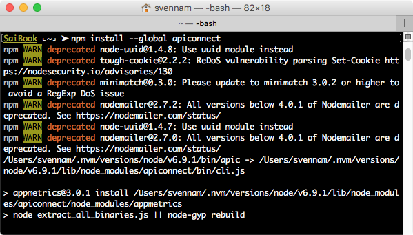
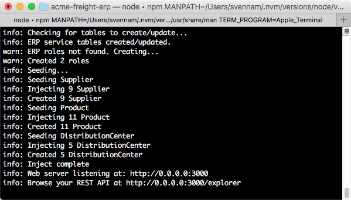
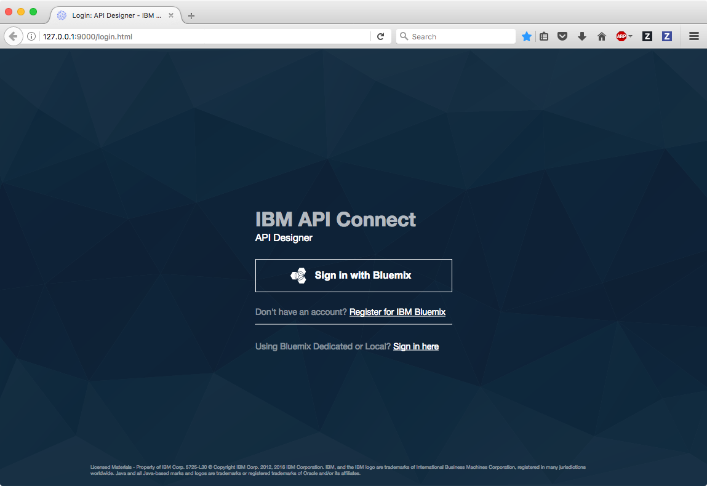
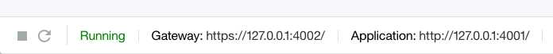
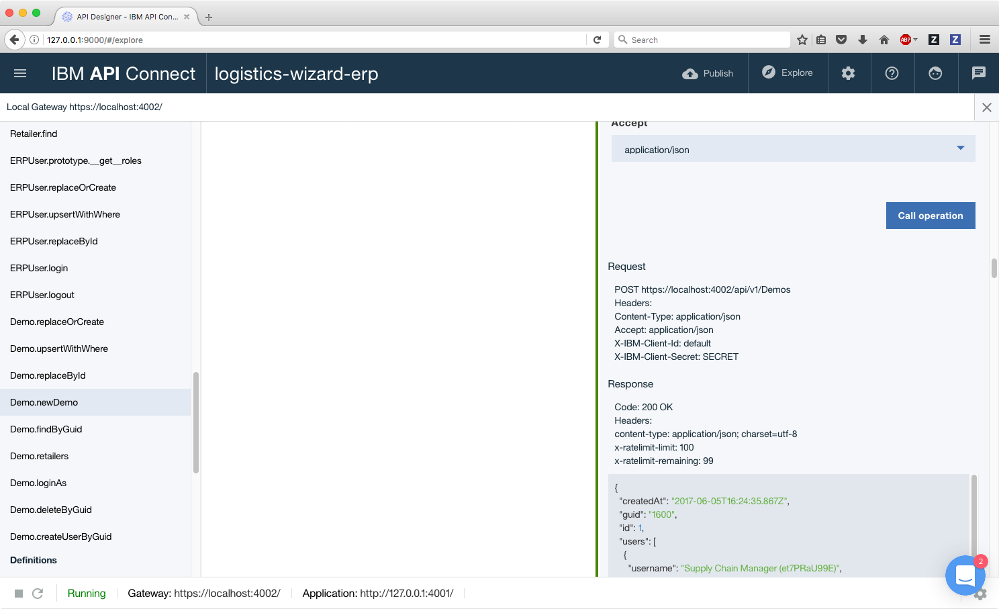

## Local Development of ERP LoopBack app

*Read this in other languages: [한국어](APIC-ERP-README-ko.md).*

### Prerequisites

#### Node.js
Node.js is a platform to run JavaScript outside of the browser. The ERP layer is a LoopBack application, which is a framework to rapidly build APIs in Node.js.

If you do not have Node.js installed, you can find the installer for your platform at NodeJS.org.

#### API Connect
Included with Node.js is the Node Package Manager, which we will use to install API Connect. In your terminal, type:

`npm install --global apiconnect`



This will install the API Connect Node.js package globally to your machine so you can work with API Connect in any local directory.

### Get the ERP code on your local machine

The two easiest ways to run the code locally on your computer is to either use git to clone the repository locally or to simply download a zip file. If you clone the repository, you can pull updates as they become available. If you only download the code, you lose that ability.

To clone the code, simple run this command in your terminal:
`git clone https://github.com/IBM/acme-freight-erp.git`

To download the code, click this link to obtain a zip archive of the entire repository:
https://github.com/IBM/acme-freight-erp/archive/dev.zip

If you were interested in editing the code and contributing your changes upstream to the master project, you could fork the repository to your Github user account and then clone your fork.

### Run the ERP code on your local machine

Once you have the code on your local machine (previous step), go into that directory in your terminal. The first thing needed is to download all the project's dependencies. You can do so by typing:

`npm install`

Once you have your dependencies downloaded, you can run the appliation by typing:

`npm start`



At that point the application runs with an in-memory database. You lose all changes when you stop the app. Let's configure a persistent storage.

### Using a persistent in-memory database

Create the file server/datasources.local.json with the following content:
```
{
 "db": {
   "name": "db",
   "connector": "memory",
   "file": "in-memory-database.json"
 }
}
```
Start the application: `npm start`
The data is now persisted in in-memory-database.json.

## Testing and Exploring your APIs

### Launch the APIC toolkit
API Connect comes with a toolkit that allows you to visually create, test and deploy APIs. To launch it, simply run apic edit from the directory of your application.
The first time you open it, it may ask you to log-in. If you have a Bluemix account, you can use it to log-in. Otherwise, make an account on Bluemix.
```
apic edit
```




### Start the application
Since the APIs have already been created, you can start the application locally to access your APIs. Click the `Play` button on the bottom left to start your application. In a few seconds the application and microgateway will start. While the application serves the actual APIs, the microgateway provides a security layer and the capability to enforce custom API policies, like rate limiting.



### Explore your APIs
Next, hit the Explore button on the top right which launches a Swagger-based view (Open API Spec) of the APIs that are available. Along the left side, you should see a number of operations with the model that you created in the previous step. Let's try calling one of these operations.

Scroll down to the `Demo.newDemo` operation and click `Try it`. Then hit `Call Operation`. You might see a notification indicating a CORS error. Override the CORS error by clicking the link, adding the exception, and then closing the tab. Then retry the `Call Operation`.



You should see a response with some user information and a GUID. This GUID is represents the session that is generated everytime the Acme Freight sample is accessed. The GUID is then used to obtain an access token (`Demo.loginAs`) which allows access to the other endpoints.

Using the API Connect toolkit, you can not only create complex APIs for security and CRUD but also test them directly on your local machine. If you want to extend the Acme Freight application, the ERP LoopBack application powered by API Connect is the perfect place to begin.
