## Create secured APIs for your OpenWhisk actions on Bluemix

*Read this in other languages: [한국어](OW-NAPI-README-ko.md).*

### Creating an API for your OpenWhisk actions on Bluemix

Once the [toolchain is installed](TOOLCHAIN-README.md), a set of OpenWhisk actions will get deployed to the region and space you chose when creating the toolchain. You can view them in the [OpenWhisk dashboard on Bluemix](https://console.ng.bluemix.net/openwhisk/manage/actions). Whenever a storm is simulated, the OpenWhisk actions are utilized to generate recommendations.

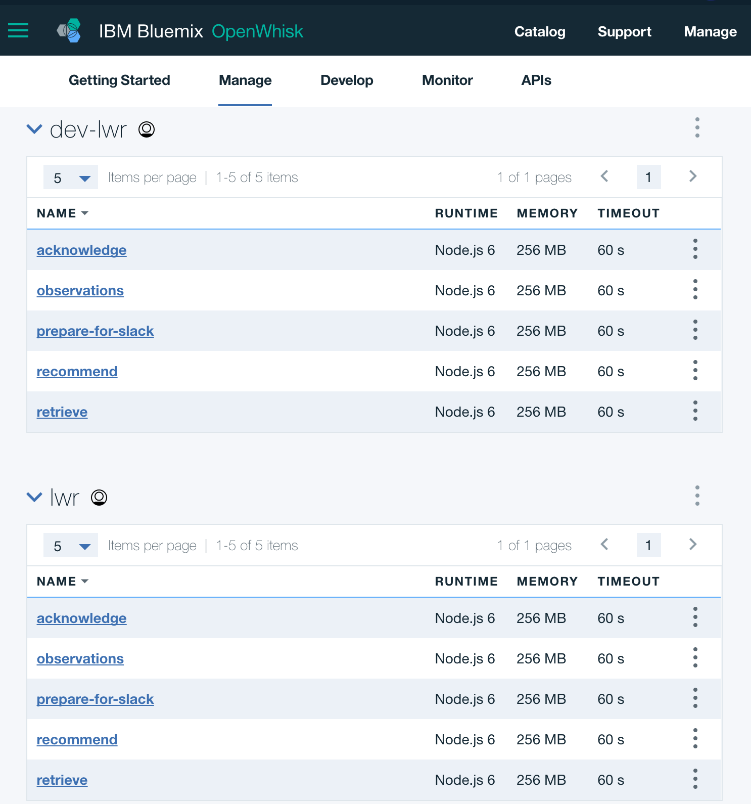

#### Create API and Endpoints

To expose these OpenWhisk actions as a part of an API, we need to click the APIs link near the top of the Bluemix OpenWhisk interface. And then click on the Create an OpenWhisk API button.

1. Create a name for your API. I chose `Acme Freight OpenWhisk API`

2. Click Create Operation button to begin adding your endpoints.

Name each endpoint to correspond with each OpenWhisk action. Choose `POST` as your Verb. Below is an example:

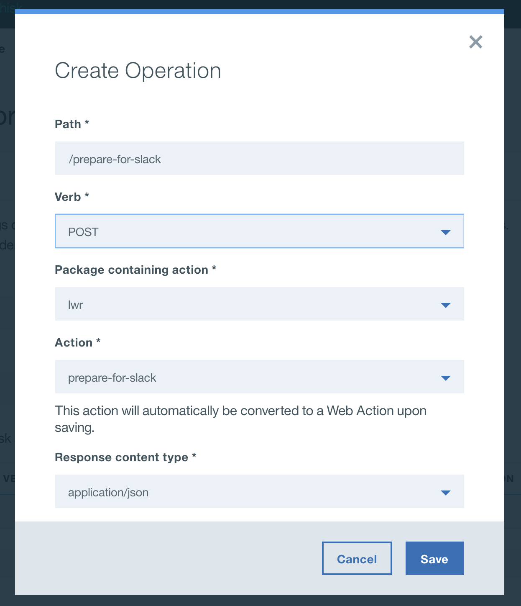

Repeat above to make an endpoint corresponding with each OpenWhisk action.

Your resulting page should look like the image below:

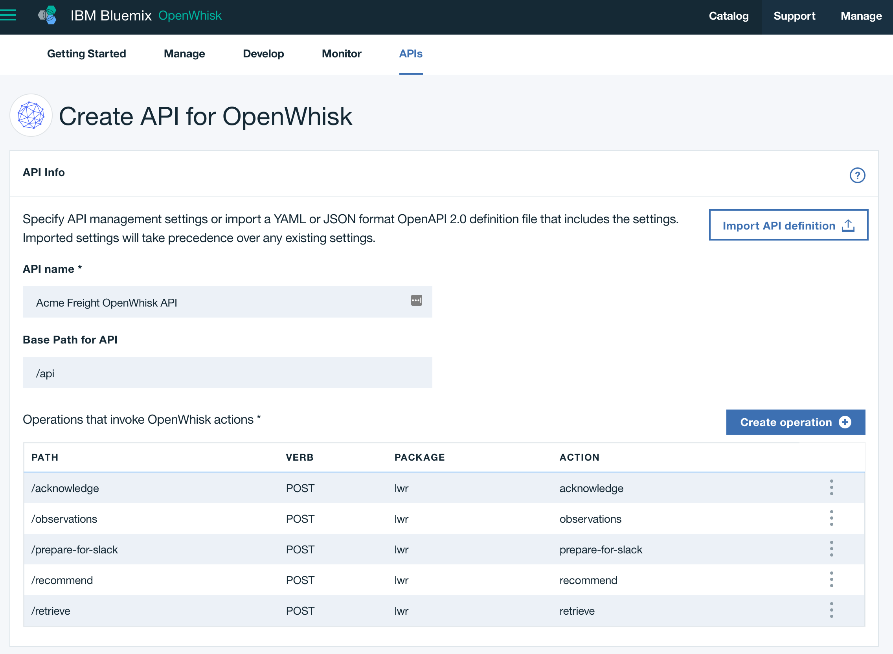

Scroll down

- Enable the "Require ... via API key" option; default options are suitable.
- Ensure the "Method" is "API key only"
- Make sure "Enable CORS..." option is checked
- Click Save button

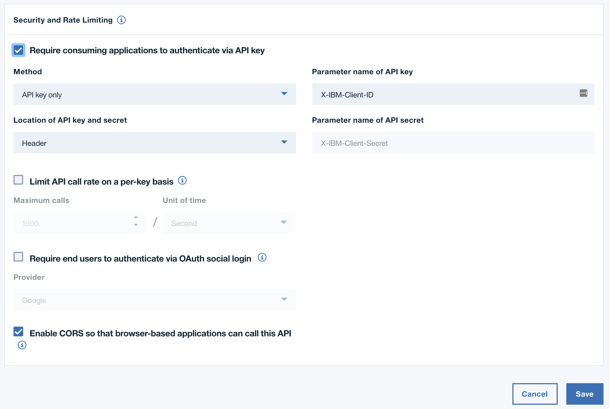

#### Create API Key

To create an API key, which is required to access the endpoints, click the "Sharing" link on the left of your screen shown below:

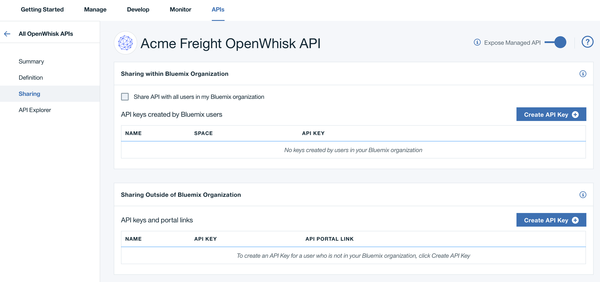

From this screen, click the "Create API Key" button.

In the Create API Key screen, do the following:

- Name your API key
- Take note of your API key
- Click "Create":

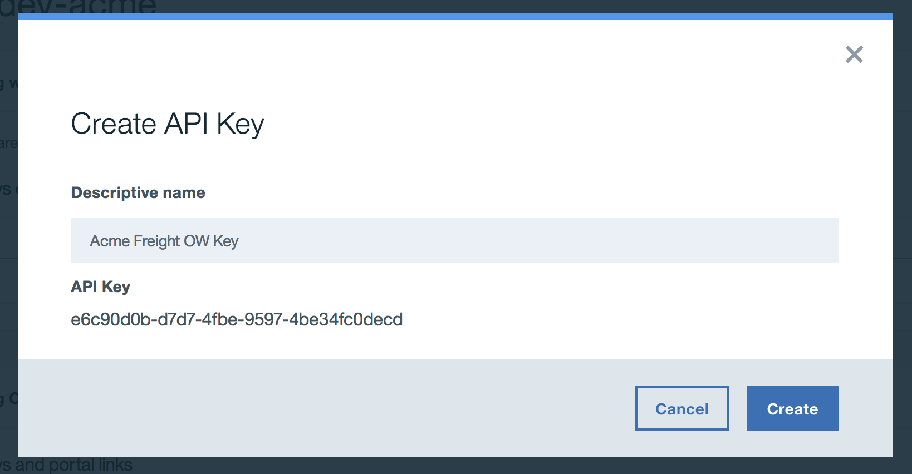

The last thing you'll need is the full path to your APIs, which you can find on the summary page (shown below as your 'Route'). Take a note of this as well for the next step.

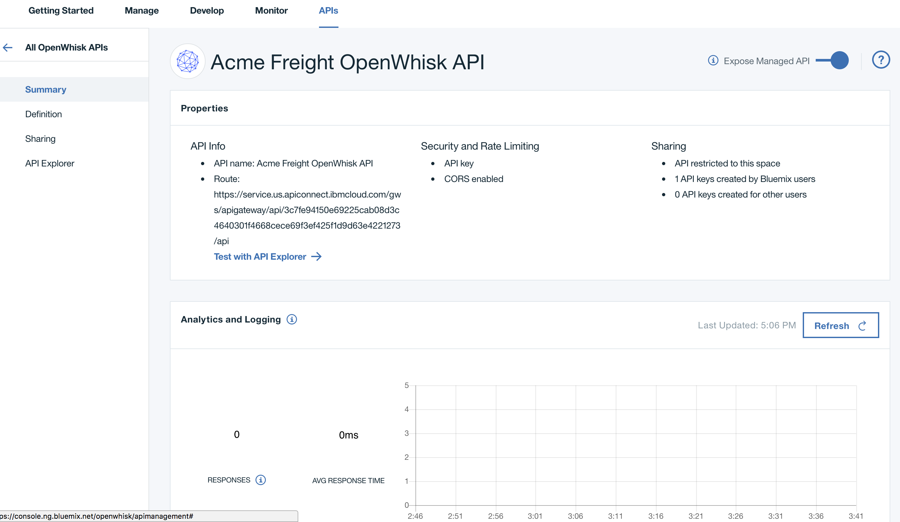

### Configure the controller application to use your newly created secure API endpoints

Now that we've created the secure endpoints, we need to update the Acme Freight microservice that calls the OpenWhisk actions. The controller application already has the code to call a secured endpoint; we simply need to tell the application your secured API URL and API key that you created earlier.

_Note: Using environment configuration is the best practice for updating the backend services that the controller needs. To access the secured API, the controller code checks if an API URL and API key are provided and uses them for requests. [See the code](https://github.com/IBM/acme-freight-controller/blob/dev/server/utils.py#L76)_

Jump to your [Bluemix DevOps toolchains](https://console.ng.bluemix.net/devops/toolchains) and click the toolchain you created for Acme Freight. You should then see the following screen, click on the square under `Deliver` for the `controller` pipeline:

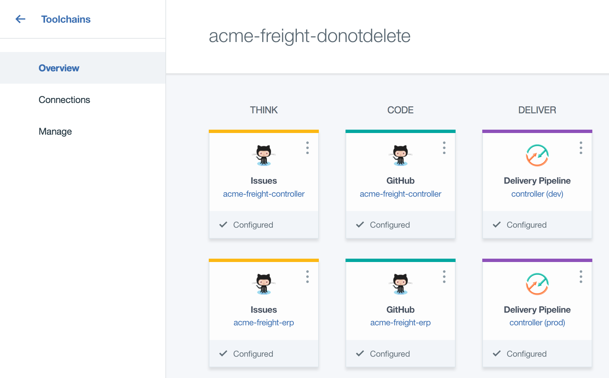

 Then click the `Configure Stage` option for the `Deploy` step of the pipeline:

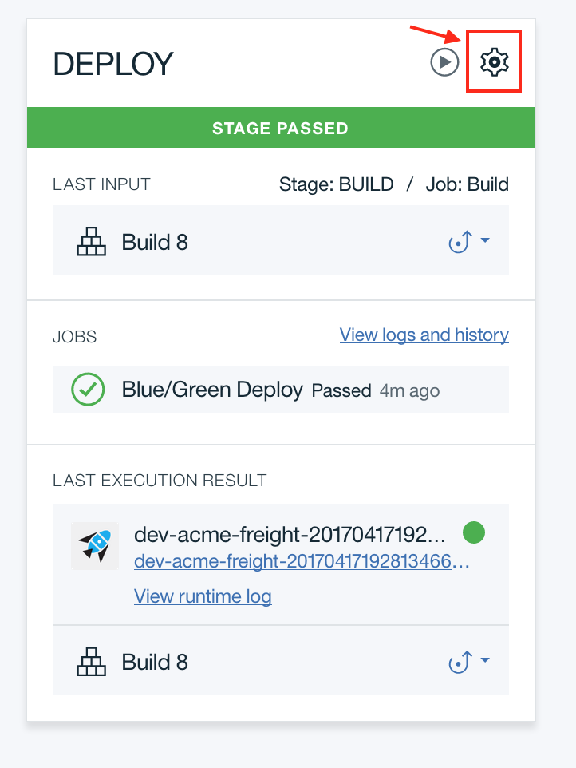

Under the `Environment Properties` tab, add two additional `Text Property` fields for `OW_API_KEY` and `OW_API_URL`. Note that it is case sensitive. Leave the other fields as-is. It should look like this:

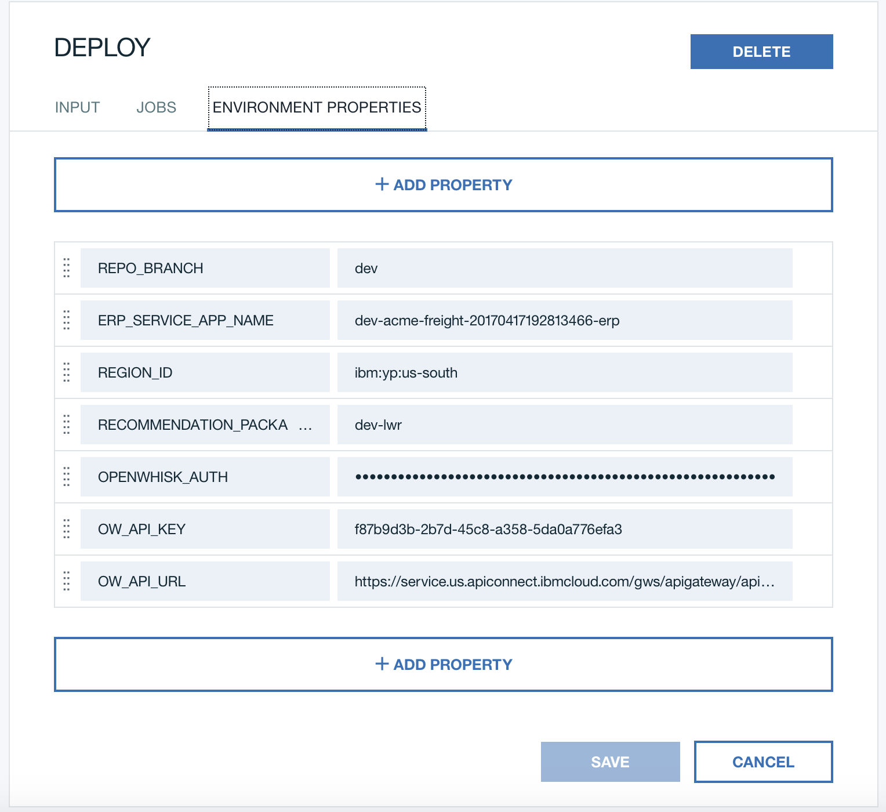

Then hit save, go back to the pipeline and hit the `Run Stage` button:

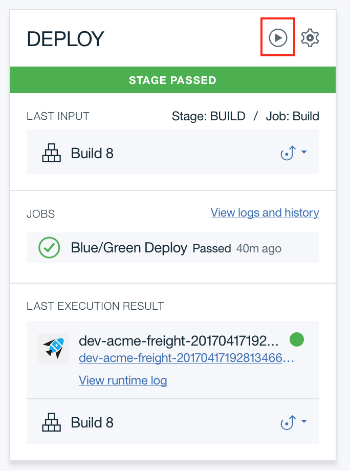

With just those few clicks, the Acme Freight application is now accessing secured OpenWhisk actions! Here are some of the advantages to securing our OpenWhisk actions:
- Set a safe rate-limit setting to protect your application (and your credit card) from malicious spamming against your OpenWhisk actions.
- Reveal your OpenWhisk endpoints to other consumer applications, not just Acme Freight. By creating API keys for each application that needs access to these APIs, you can individually track and manage consumers and even revoke access if ever necessary.
- Utilize the analytics view to see how often your APIs are being called and how long they take to fulfill. This enables you to track down latency issues as they arise.
