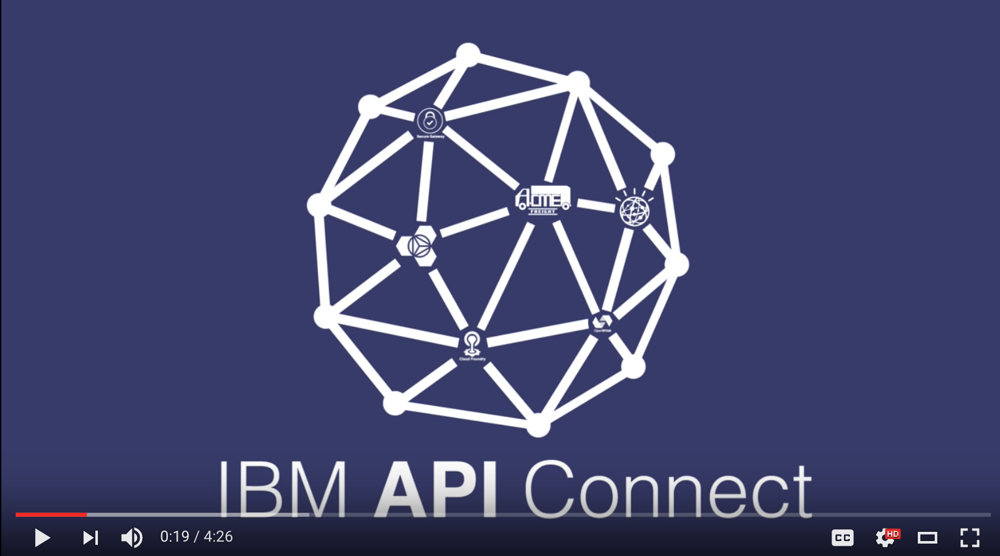
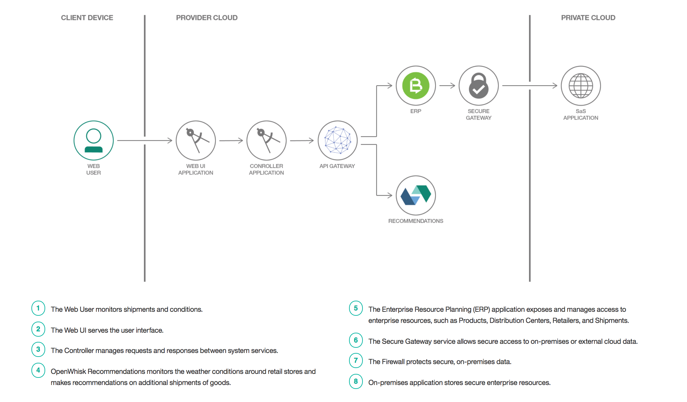

# Acme Freight 개발과정

*다른 언어로 보기: [English](README.md).*

Acme Freight Shipping은 21세기에 걸맞은 공급망 최적화 시스템 구현을 위해  [Logistics Wizard](https://github.com/ibm-bluemix/logistics-wizard) 애플리케이션 프레임워크를 사용하는 것으로 설정된 가상의 운송물류 회사입니다.

Acme Freight社는 기업 내 자산 일부를 관리하기 위해 [Logistic Wizard](https://github.com/ibm-bluemix/logistics-wizard) 라고 불리는 애플리케이션을 사용합니다. 이 애플리케이션은 3개의 Cloud Foundry 애플리케이션과 다수의 OpenWhisk 액션을 포함한 여러 마이크로서비스로 구성됩니다.

Acme Freight는 신규 애플리케이션과 기존 애플리케이션, 데이터를 위한 API를 빠르게 생성하고 노출시키기 위해 개발된 오픈소스 Node.js 프레임워크 LoopBack을 사용합니다. Acme Freight社는 LoopBack을 사용해 기존 ERP시스템과 통합된 애플리케이션을 구축하며, APIC Connect은 관리되는 API를 통해 데이터가 공개되도록 합니다.

*Acme Freight社의 개발과정과 그 이면의 기술에 대한 자세한 내용을 알아보시려면 , [Acme Freight journey 웹사이트](http://developer.ibm.com/code/journey/unlock-enterprise-data-using-apis?cm_mmc=github-code-_-native-_-acme-_-journey&cm_mmca1=000019RT&cm_mmca2=10004796)를 방문하십시오.*

## Acme Freight 튜토리얼

Acme Freight社와 그 이면의 기술에 관해 더 알아보시려면 아래 튜토리얼 중 하나로 이동하십시오.

### Acme Freight 배포하기
* [IBM DevOps Toolchain으로 여러분 소유의 Acme Freight환경을 배포합니다.](TOOLCHAIN-README-ko.md)
> 

### Node API 프레임워크 LoopBack으로 빠르게 API 생성하기
* [ERP 데이터를 LoopBack과 API Connect를 사용하여 빠르게 API로 노출시킵니다.](APIC-ERP-README-ko.md)

### 단 몇 번의 클릭으로 OpenWhisk 액션을 위한 보안성 높은 API 생성하기
* [Bluemix에서 OpenWhisk 액션을 위한 보안성 높은 API를 생성합니다.](OW-NAPI-README-ko.md)

## Acme Freight 개요
아래 비디오에서는 Acme Freight Shipping이 IBM API Connect와 Logistics Wizard 프레임워크를 사용하여 자사 공급망을 혁신적으로 민첩(agile)하게 변화시키는 애플리케이션을 어떻게 개발하였는지를 보여줍니다.

## Acme Freight 아키텍처

Acme Freight 전반적인 솔루션에서 활용되는 프로젝트는 다음과 같습니다.

* [acme-freight-erp](https://github.com/ibm/acme-freight-erp) - Acme Freight社가 사용하는 API를 정의하고 ERP 시스템에서 데이터에 접근합니다. EPR 시스템을 시뮬레이터 형태로 구현한 것이라고 보면 됩니다. 즉, 이 시뮬레이터는 PostgreSQL 데이터베이스에 연결된 Node.js 애플리케이션 형태입니다. 시뮬레이터 내 API를 통해 사용자 (공급망 관리자와 소매점 관리자), 물류센터, 소매점, 출고를 관리합니다.

* [acme-freight-webui](https://github.com/ibm/acme-freight-webui) - 진행중인 배송과 알림을 볼 수 있는 대시보드를 제공합니다. 배포된 애플리케이션 사용을 위한 로그인이나 사용자 자격증명을 요구하지 않는 대신, 해당 애플리케이션을 사용하려는 모든 신규 사용자에게 고유 데모 ID를 할당합니다. Acme Freight社는 각 데모 ID에 대해 기본적으로 비즈니스 사용자, 물류센터, 소매점, 배송에 대한 독립 환경을 제공합니다. 기능을 둘러보시려면 [walkthrough](WALKTHROUGH-ko.md) 를 참조하십시오.

* [acme-freight-recommendation](https://github.com/ibm/acme-freight-recommendation) - 날씨 상태에 따라 배송에 대한 추천을 합니다. 현재 기상조건을 검색하고 날씨에 따라 신규 배송 필요를 추천하는 등의 과정을 수행하는 Bluemix OpenWhisk 세트입니다. 추천은 실제 지시로 전환될 수 있습니다.

* [acme-freight-controller](https://github.com/ibm/acme-freight-controller) - 서비스 간 상호작용을 위한 주컨트롤러 역할을 합니다. 사용자 인터페이스로부터 요청을 받고 ERP나 날씨 추천 모듈로 요청을 전송합니다.

*Acme Freight는 IBM Bluemix 프로젝트인 Logistics Wizard에서 파생되어 확장된 것입니다. 기존 Logicistics Wizard 아키텍처와 배포에 대한 상세한 내용은 Logistics Wizard 프로젝트  [wiki](https://github.com/IBM-Bluemix/logistics-wizard/wiki) 를 참조하십시오.*

## 리소스
- [•	Acme Freight 개발과정](http://developer.ibm.com/code/journey/unlock-enterprise-data-using-apis?cm_mmc=github-code-_-native-_-acme-_-journey&cm_mmca1=000019RT&cm_mmca2=10004796)
- [•	LoopBack으로 기업 데이터 안전하게 노출시키기](https://developer.ibm.com/code/2017/05/04/unlock-enterprise-data-with-loopback?cm_mmc=github-code-_-native-_-acme-_-related-content&cm_mmca1=000019RT&cm_mmca2=10004796)

## 라이센스

라이센스 정보를 보시려면 [LICENSE](LICENSE) 를 참조하십시오.
