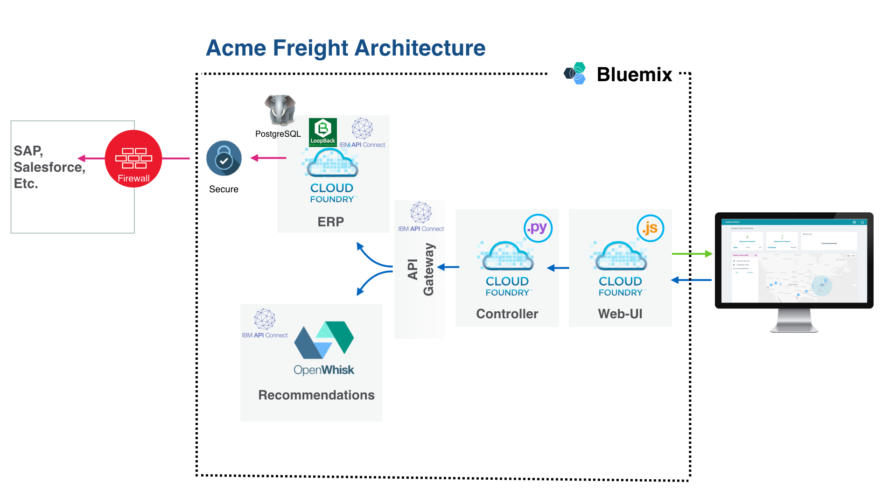

# Acme Freight Shipping

Acme Freight Shipping is a fictional shipping and logistics company using the [Logistics Wizard](https://github.com/ibm-bluemix/logistics-wizard) application framework to reimagine supply chain optimization system for the 21st century.

The video below demonstates how Acme Freight Shipping used the Logistics Wizard framework, along with IBM API Connect, to deliver an application allowing them to revolutionize the agility of their supply chain.

[](https://www.youtube.com/watch?v=R1KCrJAXLvA)

# Acme Freight Shipping Architecture (In Progress)


## Acme Freight Architecture

The following projects are leveraged in the overall Acme Freight solution:

* [acme-freight-erp][erp_github_url] - defines the API used by Acme Freight to access data from an ERP system. It also provides a default implementation to be used as a simulator. The simulator is a Node.js application connected to a PostgreSQL database. Through its API, it manages users (supply chain managers and retail store managers), distribution centers, retail stores and shipments.

* [acme-freight-webui][webui_github_url] - provides a dashboard to view ongoing shipments and alerts. There is no log-in or user credentials per se to use the deployed applications. Instead a unique demo ID is assigned to any new user trying the application. Behind each demo ID, Acme Freight creates an isolated environment with a default set of business users, distribution centers, retail stores, shipments. Refer to the [walkthrough](WALKTHROUGH.md) to get a tour of the capabilities.

* [acme-freight-recommendation][recommendation_github_url] - makes shipment recommendations based on weather conditions. It is a set of Bluemix OpenWhisk to retrieve current weather conditions and given a weather event to generate new shipment recommendations. These recommendations could then be turned into real orders.

* [acme-freight-controller][controller_github_url] - acts as the main controller for interaction between the services. It receives requests from the user interface and routes them to the ERP or the weather recommendation module.

Visit the parent Logistics Wizard project [wiki](https://github.com/IBM-Bluemix/logistics-wizard/wiki) for a detailed breakdown of the demo architecture and deployment strategy.

# Deploying, Exploring and Extending the Acme Freight Application

## Deploy your own Acme Freight on Bluemix (optional)

With the click of a button, you can deploy all the microservices and serverless actions required to run your own instance of Acme Freight. In addition, the toolchain comes with a development pipeline configured to automatically deploy any changes you push to GitHub. This is the perfect way to begin exploring the capabilities available on Bluemix and even extending the Acme Freight application.

Note that if you want to access a running instance of Acme Freight, you can access it here: 
[http://acme-freight.mybluemix.net](http://acme-freight.mybluemix.net)

  [](https://new-console.ng.bluemix.net/devops/setup/deploy/?repository=https%3A//github.com/IBM/acme-freight.git)

To get started, click the Create Toolchain button. You'll be asked to login to Bluemix - you can start with a 30 day free trial. Once logged in, you'll be asked to go through some customization options for creating the toolchain. Follow these steps:

1. Customize your toolchain name at the top - something like `acme-freight-toolchain-XXX`. Note that the URL routes are determined by the app name, so choose something unique.
1. In the `GitHub` tab, choose "Track Deployment of Code Changes" for all of the GitHub repos
1. Click the `Delivery Pipeline` tab
    * Customize the names of the applications. For example, Acme-Freight-ERP for the ERP app.
    * Retrieve your OpenWhisk Authorization Key: https://console.ng.bluemix.net/openwhisk/cli (note that the authorization key is the bit following "--auth" in the `New Authentication` section)
    * Paste that OpenWhisk Authorization Key in the appropriate field
1. Click `Create`


In about 15 minutes, the applications should finish deploying and you can start accessing your application. Go to the [Bluemix dashboard](https://console.ng.bluemix.net/dashboard/apps/) to see the status of your applications and start accessing them.

To extend the app or make changes, simply push changes to the GitHub repos that were forked for you. The Toolchain Pipeline that was deployed will take care of the rest.

## Local Development of ERP LoopBack app

### Prerequisites

#### Node.js
Node.js is a platform to run JavaScript outside of the browser. The ERP layer is a LoopBack application, which is a framework to rapidly build APIs in Node.js.

If you do not have Node.js installed, you can find the installer for your platform at NodeJS.org.

#### API Connect
Included with Node.js is the Node Package Manager, which we will use to install API Connect. In your terminal, type:

`npm install --global api-connect`

This will install the API Connect Node.js package globally to your machine so you can work with API Connect in any local directory.

### Get the ERP code on your local machine

The two easiest ways to run the code locally on your computer is to either use git to clone the repository locally or to simply download a zip file. If you clone the repository, you can pull updates as they become available. If you only download the code, you lose that ability.

To clone the code, simple run this command in your terminal:
`git clone https://github.com/IBM/acme-freight-erp.git`

To download the code, click this link to obtain a zip archive of the entire repository:
https://github.com/IBM/acme-freight-erp/archive/dev.zip

If you were interested in editing the code and contributing your changes upstream to the master project, you could fork the repository to your Github user account and then clone your fork.

### Run the ERP code on your local machine

Once you have the code on your local machine (previous step), go into that directory in your terminal. The first thing needed is to download all the project's dependencies. You can do so by typing:

`npm install`

Once you have your dependencies downloaded, you can run the appliation by typing:

`npm start`

At that point the application runs with an in-memory database. You lose all changes when you stop the app. Let's configure a persistent storage.

### Using a persistent in-memory database

Create the file server/datasources.local.json with the following content:
```
{
 "db": {
   "name": "db",
   "connector": "memory",
   "file": "in-memory-database.json"
 }
}
```
Start the application: `npm start`
The data is now persisted in in-memory-database.json.

## Testing and Exploring your APIs

### Launch the APIC toolkit
API Connect comes with a toolkit that allows you to visually create, test and deploy APIs. To launch it, simply run apic edit from the directory of your application.
The first time you open it, it may ask you to log-in. If you have a Bluemix account, you can use it to log-in. Otherwise, make an account on Bluemix.
```
apic edit
```

### Start the application
Since the APIs have already been created, you can start the application locally to access your APIs. Click the `Play` button on the bottom left to start your application. In a few seconds the application and microgateway will start. While the application serves the actual APIs, the microgateway provides a security layer and the capability to enforce custom API policies, like rate limiting.

### Explore your APIs
Next, hit the Explore button on the top right which launches a Swagger-based view (Open API Spec) of the APIs that are available. Along the left side, you should see a number of operations with the model that you created in the previous step. Let's try calling one of these operations.

Scroll down to the `Demo.newDemo` operation and click `Try it`. Then hit `Call Operation`. You might see a notification indicating a CORS error. Override the CORS error by clicking the link, adding the exception, and then closing the tab. Then retry the `Call Operation`.

You should see a response with some user information and a token. This token is generated as part of a session everytime the Acme Freight sample is accessed and is required to access the other endpoints.

Using the API Connect toolkit, you can not only create complex APIs for security and CRUD but also test them directly on your local machine. If you want to extend the Acme Freight application, the ERP LoopBack application powered by API Connect is the perfect place to begin. 

## Related Blog Posts, Videos, etc

- [Microservices on Bluemix: A multi-compute approach using Cloud Foundry and OpenWhisk](https://www.ibm.com/blogs/bluemix/2017/02/microservices-multi-compute-approach-using-cloud-foundry-openwhisk/)

- [Build a smarter supply chain with LoopBack](https://developer.ibm.com/bluemix/2016/07/11/building-smarter-supply-chain-developer-journey-loopback/)

- [Master continuous integration and delivery with the IBM Devops Toolchain](https://developer.ibm.com/bluemix/2016/08/09/master-continuous-integration-delivery-ibm-devops-toolchain/)

- [Using React and other technologies for Logistics Wizard UI](https://www.ibm.com/blogs/bluemix/2016/01/using-react/)

- [Old skills, new tricks: Unit testing OpenWhisk actions in a serverless world](https://www.ibm.com/blogs/bluemix/2016/12/unit-testing-openwhisk-actions-serverless-world/)


### Learn more

* [Bluemix DevOps Services][bluemix_devops_url]
* [Bluemix Toolchains Documentation][toolchains_overview_url]
* [InterConnect 2016 video recording][toolchains_interconnect_video_url]

<!--Links-->
[bluemix_devops_url]: https://new-console.ng.bluemix.net/devops
[github_controller_url]: https://github.com/strongloop/acme-freight-controller
[github_erp_url]: https://github.com/strongloop/acme-freight-erp
[github_webui_url]: https://github.com/strongloop/acme-freight-webui
[github_recommendation_url]: https://github.com/strongloop/acme-freight-recommendation
[coveralls_url]: https://coveralls.io/
[toolchains_overview_url]: https://new-console.ng.bluemix.net/docs/toolchains/toolchains_overview.html
[toolchains_interconnect_video_url]: https://vimeo.com/156126035/8b04b8878a


## License

See [LICENSE](LICENSE) for license information.

<!--Links-->
[webui_github_url]: https://github.com/IBM-Bluemix/logistics-wizard-webui
[controller_github_url]: https://github.com/IBM-Bluemix/logistics-wizard-controller
[erp_github_url]: https://github.com/IBM-Bluemix/logistics-wizard-erp
[recommendation_github_url]: https://github.com/IBM-Bluemix/logistics-wizard-recommendation
[toolchain_github_url]: https://github.com/IBM-Bluemix/logistics-wizard-toolchain
