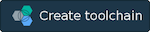

## Deploy your own Acme Freight on Bluemix with DevOps Toolchain

*Read this in other languages: [한국어](TOOLCHAIN-README-ko.md).*

With the click of a button, you can deploy all the microservices and serverless actions required to run your own instance of Acme Freight. In addition, the toolchain comes with a development pipeline configured to automatically deploy any changes you push to GitHub. This is the perfect way to begin exploring the capabilities available on Bluemix and even extending the Acme Freight application.

Note that if you want to access a running instance of Acme Freight, you can access it here: 
[http://acme-freight.mybluemix.net](http://acme-freight.mybluemix.net)

  

To get started, click the Create Toolchain button. You'll be asked to login to Bluemix - you can start with a 30 day free trial. Once logged in, you'll be asked to go through some customization options for creating the toolchain. Follow these steps:

1. Customize your toolchain name at the top - something like `acme-freight-toolchain-XXX`. Note that the URL routes are determined by the app name, so choose something unique.
1. In the `GitHub` tab, choose "Track Deployment of Code Changes" for all of the GitHub repos
1. Click the `Delivery Pipeline` tab
    * Customize the names of the applications. For example, Acme-Freight-ERP for the ERP app.
    * Retrieve your OpenWhisk Authorization Key: https://console.ng.bluemix.net/openwhisk/cli (note that the authorization key is the bit following "--auth" in the `New Authentication` section)
    * Paste that OpenWhisk Authorization Key in the appropriate field
1. Click `Create`

In about 15 minutes, the microservices should finish deploying and you can start accessing your personal Acme Freight instance. Go to the [Bluemix dashboard](https://console.ng.bluemix.net/dashboard/apps/) to see the status of your applications and start accessing them.

To extend the app or make changes, simply push changes to the GitHub repos that were forked for you. The Toolchain Pipeline that was deployed will take care of the rest.
